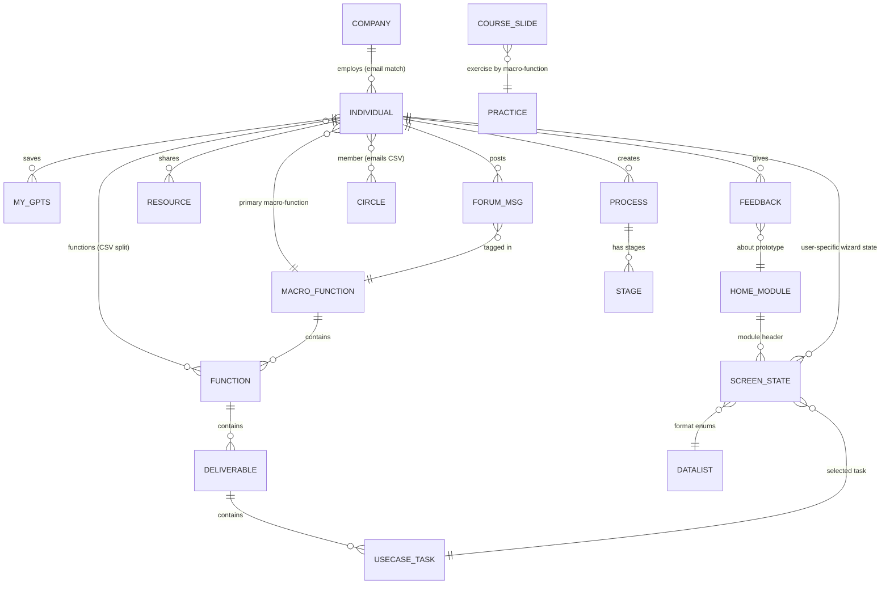

# AI for BUSINESS — Retro-Engineered Specification
### Glide prototype `aisourcinno.glide.page` → full UI/UX + database spec

| | |
|---|---|
| **Source app** | https://aisourcinno.glide.page (Glide Pages, app ID `4P7hyxb4SawKuAEkyr2d`) |
| **Tagline** | "Démocratiser l'IA pour les PME-ETI" |
| **Owner** | Sourcinno / Aymard de Scorbiac — © 2024 |
| **Spec date** | 2026-07-12 |
| **Method** | Live navigation of the published app (public screens), extraction of the full Glide schema via the app's `getAppSnapshot` payload (41 tables, 1 006 columns, computed formulas & relations), plus the owner's CSV exports and screenshots of the private screens (`docs/glideapps_prototype/`) |
| **Status of source** | Prototype. Glide team quota exceeded ("This team has reached its row limit" modal on load). 531 rows used. |

---

## 0. Feature tree — what was implemented (map of this document)

Read this tree first; the rest of the document is the detail behind each node.
Markers: ✅ live in published app · 🔒 built but behind auth/password · 🚧 built in data model, not published · each feature has a stable ID (F-xx) for referencing in brainstorms and user-story work.

```text
AI for BUSINESS (Glide prototype)
│
├─ PLATFORM — cross-cutting mechanics (§2, §4.3, §6)
│   ├─ F-PL1  Data-driven module catalogue (HOME table: 6 modules, locked flags)
│   ├─ F-PL2  Two-level access gate: per-module temp password + per-user module entitlements
│   ├─ F-PL3  AI usage quotas (per-user credits + per-screen request counters)
│   ├─ F-PL4  FR/UK bilingual content (column pairs + per-user language switch)
│   ├─ F-PL5  Per-user state everywhere via Glide user-specific columns (wizard state, ratings, toggles)
│   ├─ F-PL6  Central enum store (_datalist: levels, roles, LLMs, types, countries…)
│   └─ F-PL7  Design system: dark-indigo + violet, chip cascades, card UI, emoji iconography
│
├─ M1 AI TRAINING ✅ — Formation tab (§3.2)
│   ├─ F-T1  Marketing landing (objectives ×3, 3h parcours, à-emporter)
│   ├─ F-T2  Course player: chapters → 67 slide cards (thumbnail, duration, total)
│   ├─ F-T3  Per-slide audio commentary FR/UK
│   ├─ F-T4  Flash messages / takeaways per slide
│   ├─ F-T5  GPT Tutor: per-slide tutor prompt + in-app Q→AI answer
│   ├─ F-T6  Quizzes (3 Q/A per quiz row, tap-to-reveal answers)
│   ├─ F-T7  Personalised practice exercises, selected by user's macro-function
│   ├─ F-T8  Break slides (prompt + external link)
│   └─ F-T9  Freemium flag per slide (free access vs paid)
│
├─ M2 AI PROMPTING ✅ — Prompt tab (§3.3, logic §4.1)
│   ├─ F-P1  "Promptor" wizard: 4-level cascade Macro-fonction → Fonction → Activité → Tâche (108 tasks)
│   ├─ F-P2  Optional response-format step (langue / style / longueur / structure)
│   ├─ F-P3  Prompt generation from templates → editable rich-text → copy & open LLM
│   ├─ F-P4  In-app AI answer (text/picture) + request-quota counter
│   ├─ F-P5  Curated ready-to-use GPTs directory (Mkg&Vente / Outils / Administratif)
│   ├─ F-P6  GPT keyword search ("trouver d'autres GPTs")
│   ├─ F-P7  Standard prompt template (editable skeleton + refresh + user guide)
│   ├─ F-P8  Choose-your-LLM launcher (ChatGPT, Mistral, MS-Copilot, G-Bard, Claude)
│   ├─ F-P9  My GPTs: user-saved GPT links (category, visibility, kanban rank)
│   ├─ F-P10 🚧 Saved prompt runs / form history (incl. structure headers A–E)
│   └─ F-P11 🚧 Multi-turn GPT chat sessions (Role/Content rows, session prompts)
│
├─ M3 AI DIAGNOSIS ✅ — Cas d'usage tab (§3.4, scoring §4.2)
│   ├─ F-D1  Process inventory (CRUD), grouped by macro-function, seeded 4 processes
│   ├─ F-D2  Stage breakdown per process (CRUD) + automation/externalisation/centralisation levels
│   ├─ F-D3  Volume & cost model per stage (unit type, volume, unit cost → totals)
│   ├─ F-D4  10-axis AI-potential assessment per stage (method…video)
│   ├─ F-D5  Per-stage AI scoring (priority /5, tools example, impacts + justifications)
│   ├─ F-D6  Process-level AI synthesis: total gain €, priority /5, ranked stage table
│   └─ F-D7  🚧 Deliverable-level AI-theory forms + user data grid (B1/B2 tables)
│
├─ M4 AI STORE 🔒🚧 — tool library (C1–C4 tables, §5.5)
│   ├─ F-S1  Global AI-tools directory (desc, pricing, funding, logos, iFrame embed)
│   ├─ F-S2  Search: filters (function/category/keyword) + AI-powered search
│   ├─ F-S3  Personal tool list (my list)
│   ├─ F-S4  Community ratings → average → star display
│   └─ F-S5  Provider monetisation fields (💲 video, embedded site, rank)
│
├─ M5 AI RESOURCES 🔒 — Ressources tab, auth only (§3.5)
│   ├─ F-R1  Shared resources library by type (blog/article/video/audio/livre) + price tags
│   ├─ F-R2  👍/👎 community rating on resources
│   ├─ F-R3  Forum: macro-function & type filters, markdown posts, attachments, answers, claps
│   ├─ F-R4  Private circles (member emails → peer relations) + proximity tagging
│   └─ 🚧 F-R5 Best practices · F-R6 Provider directory + 6-axis assessment · F-R7 Peers chat · F-R8 My usual tools
│
├─ M6 my SKILLS 🔒🚧 — AI-tutored learning (D1/D2 tables, §5.5)
│   ├─ F-K1  Skill definition (field, objective, level, achievements, picture)
│   ├─ F-K2  AI-generated initial core lesson (prompt prefs: language/style/length)
│   ├─ F-K3  Source feed → AI "what's new" summary → updated core lesson (incl. api/call)
│   └─ F-K4  Notification preferences (frequency, channel) + visibility
│
├─ SUPPORT & ADMIN (§3.6–3.7)
│   ├─ F-A1  Contact form (email + message, required validation)
│   ├─ F-A2  Feedback per prototype (4 ratings + would-like-to-talk)
│   ├─ F-A3  Legal terms with per-user consent + timestamp
│   ├─ F-A4  Pricing & Stripe checkout links (Starter €199 / Master €249)
│   ├─ F-A5  Roadmap cards
│   └─ F-A6  User profile (identity, company, functions, language, avatar)
│
└─ CONTENT ASSETS (reusable regardless of platform, §5.1)
    ├─ C-1  Taxonomy: 12 macro-functions → functions → 82 deliverables → 108 use-case tasks (+ per-task needed inputs)
    ├─ C-2  Course: 67 slides across ~6 chapters, FR/UK audio, quizzes, exercises
    ├─ C-3  Prompt templates (generic skeleton + per-task assembly rules)
    └─ C-4  Curated GPT directory + datalist enums (LLMs, levels, types…)
```

**How to navigate as an AI-Designer:** feature behaviour → §3 (per screen) and §4 (logic); data behind a feature → §5.4 (table dictionary); what's reusable content vs platform mechanics → CONTENT ASSETS vs PLATFORM above; what it would take to rebuild → §7.

---

## 1. Product overview

**AI for BUSINESS** is a bilingual (FR/UK) AI-enablement suite for SME/mid-cap executives and managers. It packages, in one app, everything a non-technical business user needs to go from "curious about AI" to "using AI on my own use cases":

1. **Learn** — a slide-based training course with audio commentary, quizzes and personalised exercises (paid: Starter €199 / Master €249, Stripe links in `_admin- PRICING`).
2. **Experiment** — a guided **prompt generator** ("Promptor") that builds a high-quality prompt from the user's business context, plus a curated directory of ready-to-use GPTs.
3. **Apply** — an **AI use-case diagnostic** that decomposes a business process into stages, scores each stage's AI potential, and outputs a prioritised action table.
4. **Sustain** (partially built) — peer knowledge sharing: resources library, forum, private circles; plus draft modules for an AI-tools library, AI-tutored skills, provider directory.

The **HOME table** declares the module catalogue (the product's own map):

| # | Module | State in prototype |
|---|--------|--------------------|
| 1 | AI TRAINING | live (Formation tab) |
| 2 | AI PROMPTING | live (Prompt tab) |
| 3 | AI DIAGNOSIS | live (Cas d'usage tab) |
| 4 | AI STORE | locked 🔒 (🚧 C-tables: AI-tools library) |
| 5 | AI RESOURCES | locked 🔒 (kmPeers tables; visible when authenticated) |
| 6 | my SKILLS | locked 🔒 (🚧 D-tables: AI-tutored skill learning) |

Each module row carries FR + UK label / value proposition / description and a `locked` flag — the home screen and per-module headers are entirely data-driven.

---

## 2. Information architecture & navigation

### 2.1 Top navigation (Glide tab bar)

**Public (anonymous) visitor:**

```
AI for BUSINESS   [🏠] [🎓 FORMATION] [💻 PROMPT] [⏱ CAS D'USAGE] [✉]
```

**Authenticated user (from owner screenshots):**

```
AI for BUSINESS   [🏠] [🎓 FORMATION] [💻 PROMPT] [⏱ CAS D'USAGE] [📖 RESSOURCES] [✉] [≡ Plus ▾]
```

`≡ Plus` is Glide's overflow menu — it hosts secondary screens (profile, feedback, legal, roadmap, admin "BUILDER AREA" per `_admin- MENU` with per-user visibility choice).

### 2.2 Deep-link routes observed

| Route | Screen |
|-------|--------|
| `/dl/home` | Home |
| `/dl/formation` | Formation landing |
| `/dl/prompt-gpts` | Prompt hub (3 sub-tabs) |
| `/dl/prompt-gpts/s/<id>` | Promptor detail (task-level screen) |
| `/dl/ai-usecases` | Use-case diagnostic (process list) |
| `/dl/767bfd` | Contact form |
| `/dl/<screen>/m/<...>/r/<rowId>` | Row-level overlays (e.g. private-access modal) |

### 2.3 Access model — two nested gates

1. **Module gate ("Accès Privé")** — Prompt and Cas d'usage heroes carry an `🔒 Accès Privé` button opening a modal: *"Entrez votre mot de passe temporaire (confidentiel)"* (case-sensitive, Soumettre/Annuler). The entered value is written to a **user-specific column** (`🔓 (USC) …tempPwd entry`) on the module's screen table; template/if-then-else columns on `_users- INDIVIDUALS` (`tempPwd/` group) compare it against per-user, per-module temp passwords (`toAccess allApp / Training / Prompting / UseCase`). Content components show/hide on the comparison result.
2. **Row-level authorization** — `access/ byAyS- authorized modules _txt` (CSV string) → split → relation to HOME rows = the modules this user may see; `access/ role _nb` → `_datalist` role label; `_users- COMPANIES.authorized/ employees emails` whitelists colleagues.

Public visitors still see each module's hero + first wizard steps (demo limited to macro-function "RH"); gated content simply doesn't render.

**AI quota:** `access/ by AyS- AI credits _nb` (per user) and `maxRequest/ (USC) # request _nb` counters (per screen) cap AI calls; labels like "# free AI requests" are template columns.

### 2.4 Internationalisation pattern

No platform i18n. Every user-facing text exists as a **pair of columns** `FR x` / `UK x` plus a computed `(IF) x` that switches on `_users- INDIVIDUALS.FR-UK/ select language FR_UK`. All screens bind to the `(IF)` columns. (Course slides/prompts are EN-only "bientôt en Français".)

---

## 3. Screen-by-screen UI/UX

Design language across all screens: dark-indigo header/hero (`≈#1B1333`), violet accent (`≈#6C5CE7`), white content cards with 12–16 px radius, chip/pill choice components, purple section banners, footer bar "Propriété exclusive de Sourcinno – 🌐 sourcinno.com – 2024" + share/mail icons. Font: Inter (Roboto/Roboto Mono fallback). Icons: Glide stroke set. "Made with Glide" badge bottom-right.

### 3.1 Home (`/dl/home`)

Single marketing/landing screen, sections top-to-bottom:

1. **Hero** (dark): left = flat illustration (dashboard/people); right = H1 **"IA.CCÉLÉREZ VOTRE ENTREPRISE"**, italic quote *"3/4 des TPE/PME/ETI s'interrogent sur les cas d'usage et gains concrets de l'IA" (BPI)*, numbered promise: 1. Comment **COMPRENDRE** FACILEMENT ? 2. Puis **EXPÉRIMENTER** IMMÉDIATEMENT ? 3. Et finalement **APPLIQUER** PROGRESSIVEMENT ?
2. **PROPOSITION DE VALEUR** — purple banner section.
3. **Video** — embedded YouTube: "FORMATION À L'INTELLIGENCE ARTIFICIELLE POUR DIRIGEANTS & MANAGERS".
4. **"QUELS CAS D'USAGE POUR MOI ?"** — card: use cases vary by maturity level; DÉBUTANT = simple chatbot use, with example links (Prospection, Recrutement)… (content = `HOME.useCases ex _Rtxt` markdown).
5. **CTA button** (white on purple): "OBJECTIF : MAÎTRISER L'IA NIVEAU 1 📚" → Formation.
6. **ILS NOUS FONT CONFIANCE** — 3 black speech-bubble testimonials (DRH d'ETI, Dirigeant de PME, Directeur Marketing de PME).
7. **Footer band (purple)** — 3 columns: DURÉE (1 journée, 5/8 participants; présentiel/distance ~2-3h; exercices ~2-3h; conseil ~2-3h; "🕛 bientôt : en autonomie en ligne") | PRESTATION (-20 % PME < 20 pers.) | CONTACT (échangeons…, "c'est un humain qui répond, pas une IA !", 📧 contact@sourcinno.com). CTA "CURRICULUM DE LA FORMATION IA 📊".

On first load a Glide modal may appear ("This team has reached its row limit" — quota artifact, not product UX).

### 3.2 Formation (`/dl/formation`) — module AI TRAINING

**Landing (public):**
- Hero banner: "Comprendre les enjeux, la pratique et la mise en oeuvre".
- "À la fin de cette formation **VOUS MAÎTRISEREZ**" — 3 columns: POURQUOI – Enjeux (Vitesse d'évolution, Champ d'application, Société) / QUOI – Cas d'Usages (Ce que c'est et n'est pas, Termes clés techniques, "Prompter" VOTRE cas d'usage) / COMMENT – Déploiement (Plan d'action niveau 1, Anticipation du niveau 2, Points d'attention). Footnote: "IA" = LLM.
- Purple band **"PARCOURS de 3h"** (autonome: 1h30 de cours, hors exercices) + info card: audio/instructions/résumés FR & EN; slides & prompts EN ("bientôt en Français"); abonnement OpenAI GPT+ ou Microsoft Copilot Pro recommandé.
- **À EMPORTER**: Compréhension théorique & pratique; Modèle de Prompt Simple; Modèle de Prompt Avancé; Plan d'action niveau 1; Personnalisation de VOS GPTs; Accès à des GPTs clés (→ onglet PROMPT).

**Course player (authenticated; table `training 2- COURSE`, 67 slide rows):**
- Chapter sections ("✨ 1. UNE PREMIÈRE GORGÉE D'IA", "2. POURQUOI L'IA CHANGE TOUT", …) listing slide cards: thumbnail + title + duration (mn). `(RU) total length` = course total.
- Slide detail: breadcrumb of the chapter's slides (1-1 Bienvenue … 1-6 Quizz), **audio player** (FR/UK mp3 per slide), large slide image, **FLASH MESSAGES** card (takeaways), **GPT TUTOR** button (builds a tutor prompt via `gptTutor/ (TP) prompt`; user question + AI response stored in USC columns).
- Row types on the same table (booleans): `end chapter`, `free access` (freemium flag + logo), `is break` (break rows carry a prompt + external link), `is quizz` (3 FR/UK questions + answers, per-user "display answer" toggle), `is Advanced Exercise` (practice rows link to `training 3- PRACTISING` by the user's selected macro-function; lookups pull instructions + a markdown data table; user drafts a prompt in a USC column).
- Navigation columns compute "chapter +1" (next-chapter relation) for sequential nav.

### 3.3 Prompt (`/dl/prompt-gpts`) — module AI PROMPTING

Hero: "Expérimenter des Prompts par Cas d'Usage" + `🔒 Accès Privé`. Chip menu of 3 sub-screens:

**A. Prompts personnalisables par Fonction — the "Promptor" wizard** (`prompting 1- 👉 USC ENTRY` = state machine; `prompting 2- USE CASE` = 108-task catalogue). Public demo: "(🚧 PROTOTYPE) 👉 ILLUSTRATION EN RH 👈". Cascading chip selectors (each writes a USC column and reveals the next block):
1. **MACRO-FONCTION** (RH only in demo; full list = 12, §5.1)
2. **FONCTION** (for RH: Stratégie RH, Recrutement, C&B, Paie, Gestion de la Performance, Développement des Carrières, Formation, Communication RH, Relations Sociales, Processus et Outils RH, Relations Employés "HR BP")
3. **ACTIVITÉ** (= deliverable; e.g. for Recrutement: OKRs/KPIs et reporting, Image de marque employeur, Besoins et description des postes, Canaux de recherche de candidats, Sélection et pré-évaluation des CV, Préparation et synthèse des entretiens, Contrat de travail, Logiciels et outils)
4. **Task cards** — type badge (ANALYSER / CRÉER / CHERCHER / …) + task description; click opens the task screen:
   - "(optionnel) Format de la réponse au Prompt": LANGUE (searchable select: —, Français, English, Spanish, German…), STYLE, LONGUEUR (selects from `_datalist`), STRUCTURE (free text, placeholder "Ex. 3 bullet points; tableau avec colonnes a, b, c…").
   - **[GÉNÉRER LE PROMPT]** → purple result section: collapsible "Conseils rapides", label "PROMPT À COMPLÉTER 👉", **editable rich-text card** containing the assembled prompt (see §4.1), Modifier l'élément / Terminé, then **[Reset]** and **[PASTE IN CHATGPT >]** (copy + open LLM).

**B. Prompts prêts à l'emploi — "Sélection de Prompts à cliquer"** (curated GPT links, table `prompting 3- My GPTs` + datalist categories). Three category columns — 📊 MKG & VENTE (FICHE PRODUIT, ARTICLE & POST, 🚧 PRÉ DEVIS, 🚧 MAIL & DOCUMENT), 🛠 OUTILS (TRANSCRIPT, EXCEL, POWERPOINT, IMAGE, AUDIO, VIDEO, MINDMAP, VOX SCRIPT, BIBLIOTHÈQUE IA), 📜 ADMINISTRATIF (TOUTES FONCTIONS, VEILLE JURIDIQUE, RÉSUMEUR, DÉVELOPPEUR IT, ANALYSEUR) — each card = generated tile + name + one-line description + link. Bottom: "👉 TROUVER D'AUTRES GPTs: entrer 1 mot clé" + **[Trouver]** (keyword search building a GPT-Store query, `gptsStore/` columns).

**C. Modèle de rédaction — standard prompt template.** Purple header "Modèle standard de prompt" + collapsible "Guide utilisateur" + **[Rafraîchir le Modèle]**. Editable note card pre-filled with the generic skeleton (CONTEXTE / PROCÈDE ÉTAPE PAR ÉTAPE / FORMAT / IMPORTANT with `{✏ placeholders}`). Below: **"Choisir votre IA"** chips — ChatGPT, MISTRAL, MS-COPILOT, G-BARD, CLAUDE (logos from `_datalist prompt/[InList] LLM…`) → **[🤖 OUVRIR L'IA (coller le prompt)]** opens the selected LLM's site.

### 3.4 Cas d'usage (`/dl/ai-usecases`) — module AI DIAGNOSIS

**Process list:** hero "Prioriser les cas d'usage par Processus" + `Accès Privé`; **[+ Nouveau Processus]**; cards grouped by macro-function (seed data: Ventes / Opérations de vente / **Order to cash**; Achat / Gestion des fournisseurs / **Procure to pay**; RH / Recrutement / **Recrutement**; Mkg & Communication / Gestion des médias sociaux / **Social Network nurturing**), each card: FONCTION eyebrow, process title, description.

**Process detail** (`usecase 1- PROCESS`): breadcrumb Macro-fonction › Fonction › Processus; description; **Commentaires** card = "Idée d'automatisation par l'IA" (editable, ✏ Edit); **ÉTAPES DU PROCESSUS** + **[+ Nouvelle étape]** — numbered stage cards (1. Demande client, 2. Création du devis…) with bullet sub-tasks; **AI synthesis panel** (purple): "Potentiel de gain total : 8 000 000 €", "Priorité de mise en œuvre de l'IA : 5/5", **Tableau des Étapes par ordre des Priorités** (Priority | Stage | Time saving | Quality improvement | Implementation easiness, x/5 scores) + "Commentaire général" (Potentiel / Mise en œuvre bullets). Generated via `ai/ (TP) prompt synthesis` → `ai/result`.

**Stage detail** (`usecase 2- STAGE`): form sections —
- Identity: NUMÉRO D'ÉTAPE, TITRE, DESCRIPTION, OUTILS UTILISÉS.
- Current-state levels (chip scales *Nul ou très bas / Bas / Moyen / Haut / Très haut*): Niveau d'AUTOMATISATION / d'EXTERNALISATION / de CENTRALISATION.
- **VOLUME**: unités de mesure du coût (Minutes, ETP, Pièces, Kg, Litres, kWh), volume d'unités par étape, coût par unité → `(M) current total Unitcost`.
- **POTENTIEL DE L'IA** — 10 chip scales: besoin de connaissance méthodologique, conceptualisation, recherche de données, analyse de données, écriture, synthèse, PowerPoint, création d'image, création audio, création vidéo. COMMENTAIRES.
- **AI result** per stage: "Priorité de mise en œuvre : 4/5, Exemple d'outils : Chatbot, IMPACTS DE L'IA (Économie de temps x/5, coût unitaire actuel/gain, Amélioration de la qualité %, Facilité de mise en œuvre + justifications)" — via `ai/ (TP) prompt` → `ai/ result`.

### 3.5 Ressources (authenticated tab) — modules AI RESOURCES / km & Peers

Hero "Accéder à la connaissance de ses Pairs". Chip menu of 3:
- **SAVOIR & OUTILS** (`kmPeers 2- RESOURCES`): Type chips (BLOG, ARTICLE, VIDEO, AUDIO, LIVRE — datalist `resources/` types with emoji), list "[Savoir] BLOG" etc.: title + 👍 count + price tag (Gratuit…), 👍/👎 rating buttons, ⋯ menu, **[+]** add-resource form (title, author, description, weblink, video, picture, price).
- **FORUM** (`kmPeers 3- FORUM`): filters "in Macro-function" (chips) + "in Function" (select), Recherche + Filtrer + **[+]** new post; message cards: function eyebrow, title, type badges ("🍅 Question > 📖 Savoir"), author lookups (name, company+title+function, picture), body markdown, attachments (image/video/audio/web links), answers (`answer/` group), claps KPI.
- **MES PAIRS** (`kmPeers 4- CIRCLES` + `_users- INDIVIDUALS`): "🚧 > MY PRIVATE CIRCLES" + members button; same macro-function/function filters to find peers; circles = title/description/keywords/picture + member emails (split → relation to individuals); proximity tagging via `myPeers/ (USC) tag- proximity`.

### 3.6 Contact (`/dl/767bfd`)

"NOUS CONTACTER" card: VOTRE eMAIL (Requis), MESSAGE (Requis, textarea), **[Soumettre]** disabled until valid. Footer nav gains labels: 🏠 / Partager / Contacter. Submissions feed `_admin- FEEDBACK`-like flow (`contact/` columns on INDIVIDUALS: "email sent").

### 3.7 Secondary/admin screens (data-driven, in Plus menu)

- **Feedback** (`_admin- FEEDBACK`): per-prototype rating form — understanding / UX / relevance / would-recommend (numbers), description, "would like to talk" + coordinates.
- **Legal terms** (`_admin- LEGAL TERMS`): titled texts with per-user agreement checkbox (USC) + timestamp template.
- **Pricing** (`_admin- PRICING`): STARTER €199 (sans exercices) / MASTER €249 (avec exercices | with Promptor) + Stripe links + note.
- **Roadmap** (`_admin- ROADMAP`): title/type/details/picture cards.
- **Profile** (on INDIVIDUALS): gender (avatar from datalist), first/last, phone, country, picture (manual or default), company relation, job title, macro-function + functions (multi), language FR/UK switch (all labels have FR/UK IF variants), share link.

---

## 4. Core functional logic

### 4.1 Prompt assembly pipeline (the product's heart)

Everything is computed columns on `prompting 1- 👉 USC ENTRY` (83 cols — one active row per user via USC columns):

```
user chips (USC ids) ──(R find-row)──► taxonomy rows ──(LK)──► labels
                                                        │
   airole/  (TP) "expert en {macro-fonction} sur {fonction}" (+ sector variant)
   promptUseCase/ (LK) task, deliverable, user-required-inputs (1-5 per task)
   format/  (LK) langue, style, longueur + structure free text
                                                        ▼
   promptUseCase/ (TP) FINAL auto prompt for COPYgpt  ──► editable USC copy ──► copy & open LLM
   (variants: 🚧 prompt for API, 🚧 prompt for FileAnalysis, promptDirect Text/Code, promptCreate)
```

**Captured generated template** (task = "Analyser les CV reçus par rapport à la description du poste", RH → Recrutement → Sélection et pré-évaluation des CV, langue Spanish):

> **Contexte :**
> • Ton rôle : expert en "RH" sur les sujets de "Recrutement". Tu maîtrises toutes les bonnes pratiques relatives à : "Sélection et pré-évaluation des CV".
> • Ta tâche : assister l'utilisateur pour "Analyser les CV reçus par rapport à la description du poste."
> **PROCÈDE ÉTAPE PAR ÉTAPE** — Rédige uniquement la dernière :
> Étape 1 : pose des questions si tu as besoin de précisions. Puis attend la réponse de l'utilisateur.
> Étape 2 : Focalise-toi sur l'analyse de : 👉 [Préciser votre demande. Ex. Job description | CVs received | Candidate evaluation criteria | ATS system capabilities] 👉 [référence aux "Informations Complémentaires" ci-dessous].
> Étape 3 : Évalue ta réponse de 1 à 5. Puis corrige-la pour qu'elle atteigne 5/5.
> Étape 4 : rédige ta meilleure réponse.
> **FORMAT** — Structure: \*\*\*\*. Longueur: \*\*\*\*. Langue: Spanish. Style: \*\*\*\*. Sois très concret. Réponds directement sans être verbeux.
> **IMPORTANT :** Tu seras récompensé pour une meilleure réponse que tes concurrents LLM : prends le temps de la réflexion; procède étape par étape.
> **INFORMATIONS COMPLÉMENTAIRES** — 👉 [contenu d'un document à analyser] / 👉 [pièce jointe à prendre en compte].

The generic template (Modèle de rédaction) is the same skeleton with `{✏ …}` placeholders (fonction/secteur, utilisateur & niveau, tâche, étapes, langue, structure, ton, longueur).

**In-app AI answers**: `aiAnswer/ (USC) ai launched` + `ai answer text/picture` columns imply a Glide AI / webhook action fills the answer inline (config not exportable). Draft tables 🚧 FORM HISTORY + GPT CHAT extend this to saved sessions and multi-turn chat (session ID, Role/Content rows, "(TP) 1st/other prompts for chat", `(RU)` message counts, `api/ call` yes-code column on D2 = direct API call experiment).

### 4.2 Diagnostic scoring model

- Stage workload: `wkld/ units volume × unit cost → (M) current total Unitcost`; use-case level: `mn to method/analyse/text/mmdia × yearly occurrences → (M) deliverable workload`.
- AI impact: `prompt/ level biz impact _nb` × `(M) impact multiplicator` → `# AI impact`, `% AI impact`, "AI impact % and hours" labels.
- Roll-ups: reduce / reduce-to-member-by / join-strings chains give per-function and per-macro-function totals and "highest" items (`wkld/`, `AIpty/` groups on FUNCTION & USE CASE) — powering the priority tables.
- Final synthesis prompt (per process) concatenates per-stage results (`map-rows → join-strings → (TP) prompt synthesis`) and stores `ai/result` + `ai/priority`.

### 4.3 Reference data pattern

`_datalist` (18 rows × 76 cols) is a **column-per-enum** lookup: each column holds one enum's values across 18 indexed rows (levels/stars/emoji scales, user roles & genders+avatars, company types/sizes/sectors, LLM list (name/logo/url), prompt type-request/length/style/structure, resource types & prices, forum message/topic types, GTM enums, admin menus, country list with flags/currencies/languages). Screens do `find-row` by index/id then `with`-lookup label+emoji+image. **Migration note:** replace with proper `enum_type(code,…)` + `enum_value(type, id, label_fr, label_en, emoji, image, rank)` tables.

---

## 5. Database specification

### 5.1 Seed taxonomy (the content backbone)

- **12 macro-functions** (`_structure- MACRO FUNCTION`, ranked): Stratégie, R&D-Innovation, Mkg & Communication, Ventes, Achat, Production, Logistique, RH, Finance, IT, Juridique, "Transversal".
- **Functions** (`_structure- FUNCTION`): per macro-function (11 seeded for RH), + per-user priority/order (USC) and workload/AI-priority rollups.
- **82 deliverables** (`_structure- DELIVERABLES`): id, title, description, macro-function + function ids.
- **108 use-case tasks** (`prompting 2- USE CASE`): deliverable-level tasks with type (ANALYSER/CRÉER/CHERCHER/…), biz-impact level, up to 5 "user needed inputs".
- **67 course slides** (`training 2- COURSE`) across ~6 chapters; practice rows per macro-function in `training 3- PRACTISING`.

### 5.2 Entity-relationship overview (active modules)



(Draft modules add: FORM_HISTORY 1–N GPT_CHAT; AI_TOOL N–N CATEGORY & macro-function; MY_LIST join user×tool; SKILL 1–N SOURCE; PROVIDERS; BEST_PRACTICES.)

### 5.3 Conventions used in the Glide schema (decoding key)

- Sheet prefix = module; `🚧` = draft module not in published nav; `❓` = orphan.
- Column groups by prefix `group/`; suffix = type (`_txt/_nb/_img/_url/_date/_boolean/_Rtxt(markdown)/_emoji`).
- Computed-column markers: **(R)** relation find-row · **(SP)+(R)** filter-rows multi-relation · **(LK)** lookup · **(JL)** join-strings · **(TP)** template · **(IF)** if-then-else · **(SP)** split · **(RU)** rollup / reduce-to-member-by · **(SV)** single-value get-nth(-last) · **(M)** math · **(Q)** query filter-sort-limit · **(USC)** user-specific (per-user value!) · **(XLS)/(JS)** yes-code JS · plugin-computation (device type) · generate-image (auto avatars/logos/tiles).
- Every table has `🔒 Row ID`. "Fake for relation" template columns create constant-key relations (screen-singleton pattern).
- **USC columns are the app's per-user state store** — in any rebuild they become per-user state tables/columns (session or DB), *not* shared fields.

### 5.4 Data dictionary — active tables

*(stored columns; computed columns noted where structurally meaningful. Full raw schema incl. every computed column: `db-schema-notes.md` companion file.)*

**`_users- INDIVIDUALS`** (user; 62 cols) — id, email, timestamp; role (→ datalist), authorized modules CSV (→ HOME rel), AI credits; per-module temp passwords + per-module USC entry + IF match; idcard: gender (→ avatar), first/last (+full-name TP), phone, device type (plugin), country, picture manual/IF display; business: company email→COMPANY rel + lookup, job title, macro-function id (→ rel+label), function ids CSV (→ rels+joined labels), "Company + Title + Function" display; myPeers proximity (USC); contact email-sent; FR-UK language switch + translated field labels (IF×7); admin comments + share link; progress-bar TP; favorited (USC).

**`_users- COMPANIES`** (29) — 🔒 id, creator user id (→ INDIVIDUALS), created timestamp; name, type, sector, description, www; legal id, address, town, zip, country; logo manual / Clearbit URL (TP) / auto (generate-image) / display (IF); size type + employees count; authorized employee emails CSV (+ creator, split); payer: offering ref, paid flag.

**`_structure- MACRO FUNCTION`** (4) — 🔒 id, rank, title.
**`_structure- FUNCTION`** (20) — 🔒 id, title, macro-function id (→ rel+label); USC per-user priority & order; workload + AI-priority rollups (per-function count, per-macro-function sum, highest member + label chains).
**`_structure- DELIVERABLES`** (12) — 🔒 id, title, description, macro-function id, function id (→ rels); USC home-menu choice; fake-relation to USC-ENTRY screen.

**`HOME`** (26) — 🔒 id, module nb, module title, locked bool, FR/UK label + valueProp + description (+IF), picture, background, video, useCases markdown; generalities IF titles (home screen texts switching FR/UK).

**`training 1- HOME`** (14) — screen singleton: USC tempPwd entry; IF title/subtitle/testimonies/value-added/takeaways/warning; FR testimonials markdown + JS-formatted testimony.
**`training 2- COURSE`** (73) — 🔒 id; chapter # + FR/UK title (+TPs+IF), end-chapter bool, USC display-chapter; slide # + FR/UK titles (+TPs+IF), free-access bool (+IF logo), length + total rollup; content: thumbnails, slide image (+IF), FR/UK takeaways (+IF), FR/UK audio (+IF), video, FR/UK instruction markdown (+IF); practice: is-advanced bool, FR/UK title, USC macro-function select → PRACTISING rel + lookups (instructions, data table); breaks: is-break, prompt, link; quizz: is-quizz, FR/UK lessons-learnt (+TPs+IF), 3× FR/UK questions + answers, USC display-answer; gptTutor: USC show/hide, TP prompt, USC user question, USC AI response; navigate: self-relation lessons, chapter+1 math+rel, password SV.
**`training 3- PRACTISING`** (15) — 🔒 id; macro-function id (→ rel + label + rank); FR/UK question (+IF); data-table markdown; USC showHide (+JS even + SV); SV prompt template from USC-ENTRY; USC user prompt.

**`prompting 1- 👉 USC ENTRY`** (83) — screen singleton; module nb → HOME rel + valueProp lookup; USC tempPwd; intro: USC ai-output-type / request-type (→ datalist + labels), save-request bool, request title; airole: USC macro-function + function ids (→ structure rels + labels), 🚧 sector (→ datalist), TP/IF role-string assembly; format: USC display-format, language, style, structure, length (+ datalist rels + labels); promptGeneric TP+USC+copyTo; promptUseCase: USC deliverable + task ids (→ USE CASE rels + labels), required-inputs lookup + USC, **TP FINAL auto prompt**, USC final, 🚧 API/FileAnalysis TPs; promptFindCase (sector+function); promptDirect (Text/Code TPs + IF + USC); promptCreate (user entry + TP); aiAnswer: USC corrected prompt, launched nb, answer text/picture (+IFs); maxRequest counter + TP; gptsStore keyword/show-hide/TP result; interact menus (menuPrompts, menuMethod, history + even-JS, hide-answer + even-JS).
**`prompting 2- USE CASE`** (68) — 🔒 task id; macro-function/function/deliverable ids (→ rels + labels + UPPER); **title task**, type, biz-impact level (+ multiplicator), user needed inputs 1–5 (+TP); AsstStep1/2: USC view selections + per-user workload inputs (mn×4, yearly occurrences) + math (workload, AI impact #/%, label) + function lookups; wrkld/AIpty rollup chains; testAI (USC prompt/type/launched/answer + IF); aiStore SV+TP; export: USC csv link, TP prompt-for-csv, result; interact (home menu, guide + even-JS, synthesis submenu).
**`prompting 3- My GPTs`** (14) — 🔒 id, user id, timestamp, SV password; macro-category (→ datalist + label); title, description, url, public bool, generated picture, kanban rank.

**`usecase 1- PROCESS`** (27) — 🔒 id, user id, timestamp, USC tempPwd; macro-function + function ids (→ rels, labels, UPPERs, TP combos); **title**, description, yearly occurrences, comments ("idée d'automatisation"); ai: rel → STAGE rows, map+join per-stage results, TP synthesis prompt, result, priority; favorited.
**`usecase 2- STAGE`** (34) — 🔒 id, user id, process id (→ rel + labels); stage # + title (+UPPER+TP), description; tools; automation/outsourced/centralized levels; volume: unit type, units per stage, unit cost, (M) total; 10 skill-need levels (method, concept, data search, data analysis, writing, synthesis, ppt, image, audio, video); comments; ai TP prompt + result.

**`kmPeers 1- HOME`** (16) — screen singleton: module → HOME rel; rank/title; TP user email; USC menus (top, macro-function, function, resource subtype, peers proximity) + rel → CIRCLES.
**`kmPeers 2- RESOURCES`** (28) — 🔒 id, user (→ rel + email), date, archive; category: type + subtype (→ datalist + labels + emoji + TP), macro-function + function ids; title, author, description, weblink, video, picture; price (→ datalist + label); USC user rate + TP "price + sum rates".
**`kmPeers 3- FORUM`** (37) — 🔒 msg id; user (→ rel + name/email/company-title-function/picture lookups), timestamp, archive; origin: macro-function (→ rel+label), type msg + type topic (→ datalist + labels + TP combos), title, body markdown, attachment image, video/audio/website links; answer: source msg id, body; display: USC show-hide + filters (expertise/type post/type request) + IF no-select; kpi: USC claps, count, TP.
**`kmPeers 4- CIRCLES`** (11) — 🔒 id, owner ids, timestamp, title, description, keywords, generated picture, member emails CSV → split → rel INDIVIDUALS.

**`_admin- MENU`** (5) — id, title, USC visibility choice. **`_admin- LEGAL TERMS`** (5) — title, USC agreement + TP. **`_admin- PRICING`** (7) — id, title, amount, Stripe link, TP note (rows: STARTER 199 / MASTER 249). **`_admin- ROADMAP`** (6) — title, type, details, picture. **`_admin- FEEDBACK`** (16) — 🔒 id, user id, date, prototype (→ HOME rel + label), description, 4 ratings (understanding/ux/relevance/recommend), would-like-to-talk bool, coordinates, writer email, message-sent.

**`_datalist`** (76 cols × 18 rows) — enum store, see §4.3.

### 5.5 Draft (🚧) & orphan tables — summary

| Table | Purpose (state: built, not published) |
|---|---|
| 🚧 prompting 3- FORM HISTORY (38) | Saved Promptor runs: form snapshot (intro/aiRole/structure incl. headers A–E), TP request & prompt, AI result + picture, session→chat SV, (Q) max-credit |
| 🚧 prompting 4- GPT CHAT (18) | Multi-turn chat per session: Role/Content, response (+IF loading), session rel + count, TP first/next prompts |
| 🚧 B1_usecaseAI- FORM (40) / B2- USC DATA (14) | AI-theory per deliverable (impact, limitations, standard prompt) + workload math; per-user 6-column scratch data grid feeding a prompt model |
| 🚧 C1–C4 libraryAi (31/52/10/6) | **AI STORE**: search screen (filters + AI search → tool rels), global tool directory (desc, pricing, funding, categories, logos, iFrame, ratings avg→stars, 💲 provider fields), my-list join, categories |
| 🚧 A4-office USUAL TOOLS (7) | User's usual office tools list |
| 🚧 peers X- CHAT (7) | Simple chat feed |
| 🚧 km 2- BEST PRACTICES (11) / km 3- PROVIDERS (29) | Best-practice cards; provider directory with 6-axis USC assessments + increments |
| 🚧 _admin- PROMPT ENGINEERING (9) | Prompt-technique knowledge base (need, priority, technique, guideline, examples) |
| 🚧 D1 skillAi- SKILLS (45) / D2- SOURCES (29) | **my SKILLS**: AI-tutored skill (scope, objective, notification prefs, prompt prefs → TP initial lesson, AI core lesson + updates); sources feeding "what's new" + updated core lesson via 2 TP prompts + `api/ call` yes-code |
| ❓ _structure- output category (6) / ❓ _aistack pricing (7) | Orphan enums: output-need categories; AI-stack offer pricing |

---

## 6. Design system (observed)

| Token | Value (approx.) | Usage |
|---|---|---|
| bg-header/hero | `#1B1333` dark indigo | top nav, heroes, footer |
| accent | `#6C5CE7 → #7C5CFF` violet | primary buttons, banners, active chips, links |
| accent-banner | `#7454E0` | section bands (PROPOSITION DE VALEUR, wizard headers) |
| surface | `#FFFFFF` cards on `#F6F6F6` page (theme-color meta) | content |
| chips | white pill, 1px gray border; selected: violet border + violet text + lavender fill | all selectors |
| radius | ~10–16 px cards, 999 px chips/buttons | |
| type | Inter 400/500/600/700/800 (Roboto fallback) | UI |
| headings | ALL-CAPS section labels; sentence-case card titles | |
| icons | Glide stroke SVGs (house, desktop, gauge, mail, share, chevron) + emoji as functional iconography (🔒🚧👉📚💻⏱📖✉) | |
| components | tab bar w/ pill highlight, chip cascades, searchable selects, rich-text editable cards, task cards w/ type eyebrow, speech-bubble testimonials, audio player, slide viewer, rating thumbs, purple result panels, modals (password, row-limit) | |

---

## 7. Rebuild / migration notes (Glide → standard stack)

1. **USC columns → per-user state.** Split every `(USC)` column into (a) wizard/session state (client state or `user_screen_state` table) and (b) persistent per-user data (ratings, agreements, selections) as join tables keyed `user_id × row_id`.
2. **Computed columns → derived layer.** TP/IF/LK/JL = presentation-layer formatting or SQL views; RU/M = aggregates (SQL window/group) — don't persist except caches. The FR/UK IF pairs collapse into a normal i18n dictionary.
3. **`_datalist` → enum tables** (§4.3), with rank, emoji, image, FR/EN labels.
4. **Screen-singleton tables** (USC ENTRY, kmPeers HOME, training HOME) are *not* entities — they're wizard state + static copy. Model the copy as CMS content, the state per §1.
5. **Auth**: replace temp-password gates with real auth (magic link/SSO) + module entitlements table (`user_module(user_id, module_id, granted_by, ai_credits)`), keeping the same UX shape (locked hero + unlock).
6. **AI calls**: today = Glide AI/webhook actions writing into `ai answer` columns + "copy & open ChatGPT". Rebuild as a server-side LLM gateway with the captured prompt templates (§4.1), quota middleware (credits), and optional chat sessions (FORM HISTORY/GPT CHAT schema is a ready design).
7. **Keep the taxonomy** (12 macro-functions → functions → 82 deliverables → 108 tasks + per-task needed-inputs): it is the product's differentiating content asset; CSVs in `docs/glideapps_prototype/` are the seed fixtures.
8. **Known gaps (not extractable from Glide):** button/action wiring (Glide "actions"/workflows), yes-code JS bodies, Glide AI action configs, email/notification integrations, Stripe checkout wiring. These need re-specification at build time; everything else in this document is verbatim from the running app.

---

## 8. Sources

- Live app: https://aisourcinno.glide.page (public screens navigated 2026-07-12; screenshots taken of Home, Formation, Prompt ×7 wizard states, Cas d'usage, Contact, password modal).
- Schema: `POST /api/container/playerFunctionCritical/getAppSnapshot` → `schema.tables` (41 tables, 1 006 columns incl. formulas/relations), `numRowsUsedInApp: 531`.
- Owner exports: `code-AI4CEO/docs/glideapps_prototype/` — 30 CSV table exports + 11 screenshots of authenticated screens (prompts, training player, use-case detail & stage form, resources/forum/circles).
- Companion working file: `ai4business_db_schema_notes.md` (full raw schema notes, table-by-table).
